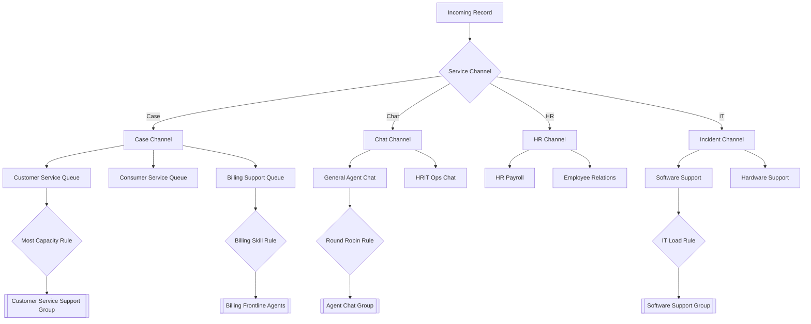

# Comprehensive Advanced Work Assignment (AWA) Configuration Report

This document provides a full, un-trimmed detailed overview of the automatic work assignment (AWA) configuration in the current ServiceNow instance.

## 1. Service Channels (The Entry Points)
Service channels define the types of work that AWA can route. There are **23** configured channels.

| Channel Name | Target Table | Active | Routing Condition |
| :--- | :--- | :---: | :--- |
| **Case** | sn_customerservice_case | True | numberSTARTSWITHCS |
| **Chat** | chat_queue_entry | True | type=chat |
| **Incident** | incident | True | (No specific filter) |
| **HR Case** | sn_hr_core_case | True | (No specific filter) |
| **Email** | sys_email | True | type=email^direction=inbound |
| **Phone** | (Interactions) | True | type=phone^callback_taskISEMPTY |
| **Billing Complaint** | sn_customerservice_case | True | active=true |
| **Procurement Cases** | sn_prc_case | True | channel_source=email |
| **Walk-up** | (Walk-up Interactions) | True | type=walkup |
| **Invoice Inquiry** | sn_customerservice_case | True | channel=email |
| **Order Case** | sn_customerservice_case | True | active=true^assigned_toISEMPTY |
| **Callback** | (Interactions) | True | type=phone^callback_taskISNOTEMPTY |
| **Video Callback** | (Interactions) | True | callback_task!=^type=video |
| **Finance cases** | (Finance Table) | True | (No specific filter) |
| **Supplier Cases** | (Supplier Table) | True | (No specific filter) |
| **Legal Request** | (Legal Table) | True | (No specific filter) |
| **Material Master** | (Requests Table) | True | (No specific filter) |
| **Equipment Master**| (Requests Table) | True | (No specific filter) |
| **Amazon Connect** | (Phone) | True | type=phone^ccc_source=amazon_connect |
| **Chat - Async** | chat_queue_entry | True | subtype=mweb^type=messaging |
| **WhatsApp** | (Messaging) | **False** | subtype=WhatsApp |
| **SMS** | (Messaging) | **False** | subtype=SMS |
| **Order** | (Order Task Table) | **False** | sys_class_name=sn_ind_tmt_orm_order_task |

---

## 2. Work Queues (Detailed Logic)
Queues categorize incoming work based on specific business rules.

### Customer Service Management (CSM)
*   **Customer Service Cases**: Targets Cases where Account or Contact is NOT empty.
*   **Consumer Service Cases**: Targets Cases where Consumer is NOT empty.
*   **Billing Support**: Linked to Chat channel, filtered for "Billing Issue" categories.
*   **Product Support**: Linked to Chat channel, filtered for "Product Issue" categories.
*   **Order Support**: Linked to Chat channel, filtered for "Order Issue" categories.

### Human Resources (HR)
*   **HR Payroll Case**: Routes cases where service table is `sn_hr_core_case_payroll`.
*   **Employee Relations Case**: Routes cases where service table is `sn_hr_er_case`.
*   **HR Talent Management**: Routes cases where service table is `sn_hr_core_case_talent_management`.
*   **HR Workforce Administration**: Routes cases where service table is `sn_hr_core_case_workforce_admin`.
*   **HRIT Operations Case**: Routes cases where service table is `sn_hr_core_case_operations`.

### Information Technology (ITSM)
*   **Software Group Queue**: Routes incidents assigned to the Software Group.
*   **Hardware Support Queue**: Routes incidents assigned to Hardware Support.
*   **Network Engineering Queue**: Routes incidents assigned to IT Network Engineering.
*   **Concur Support Queue**: Specialized queue for Concur-related incidents.
*   **Client System Engineering**: Specialized IT support queue.

---

## 3. Assignment Rules (The Routing Intelligence)
These rules determine *which* agent in a group receives the work item.

| Rule Name | Strategy | Max Capacity |
| :--- | :--- | :---: |
| **Chat - Most Capacity** | Most Capacity | 4 |
| **Email cases - Most capacity** | Most Capacity | 5 |
| **Incident assignment rule** | Most Capacity | 3 |
| **HR Capacity & Skill** | Capacity & Skill | 2 |
| **Case Assignment Rule (Skills)**| Skill-Based | 4 |
| **Round Robin (Phone)** | Round Robin | 1 |
| **Specialized (Santa Clara)** | Location-Based | 2 |

---

## 4. Full Flow Diagram (AWA Logic)

## 5. Agent Capacity Summary
Across all active channels, agents are typically configured with:
*   **Chat Capacity**: 4 concurrent sessions.
*   **Case Capacity**: 5 concurrent cases.
*   **Incident Capacity**: 3 concurrent incidents.

*Report generated by ServiceNow MCP on 2026-02-15*
